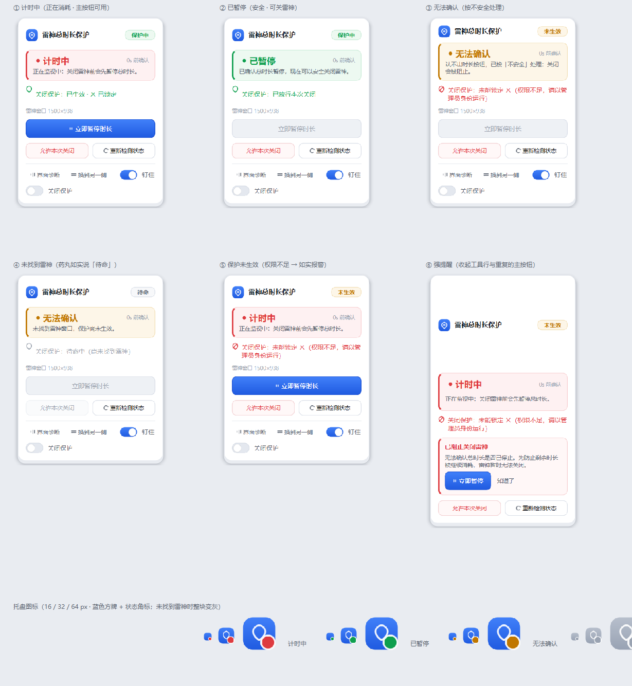

# LeigodGuard · 雷神总时长保护

> **关掉加速器之前，先替你把「计时」停下来。**
>
> 一个 Windows 小工具：当你要关闭雷神加速器时，它会先自动暂停「总时长」，
> **确认暂停成功之后**才放行你的关闭操作 —— 避免"客户端关了、计时还在跑"白白扣时长。
>
> *A small Windows companion for Leigod accelerator: it pauses your paid time
> **before** the client closes, and only lets the close through after confirming
> the pause actually took effect. Chinese UI / Chinese docs.*



---

## 目录

- [它解决什么问题](#它解决什么问题)
- [30 秒上手](#30-秒上手)
- [界面怎么看](#界面怎么看)
- [它是怎么工作的](#它是怎么工作的)
- [已知限制（请先读）](#已知限制请先读)
- [常见问题](#常见问题)
- [隐私](#隐私)
- [反馈与建议](#反馈与建议)
- [开发与验证](#开发与验证)
- [许可与免责](#许可与免责)

---

## 它解决什么问题

按时间计费的加速器（"总时长"）有个典型的坑：

1. 你在客户端里点了「暂停时长」→ 时长停了；
2. 但很多人是**直接点 ✕ 关掉客户端**的 —— 如果关之前没暂停，那一晚的时长就白扣了；
3. 更烦的是：客户端**关掉之后计时还在继续**，你第二天才发现。

这个工具做的就是补上这一步：**你照常点 ✕，暂停这件事交给它，而且它确认成功了才放你走。**

三种状态对应三种处理，没有"猜"的余地：

| 时长状态 | 点 ✕ 时它会做什么 |
| --- | --- |
| 计时中 | 先暂停 → **重新读到「已暂停」** → 才放行关闭 |
| 已暂停 | 直接放行 |
| 读不出来 | **拦住关闭**，并告诉你去哪一步处理（宁可拦你，也不让你以为停好了） |

---

## 30 秒上手

1. 到 [Releases](../../releases) 下载 `LeigodGuard-*.zip`，解压到任意目录（**别放 C 盘根目录**，会因为没有写权限而存不了配置）。
2. 双击 **`立刻待命.bat`**。
   *会弹一次 UAC 授权框 —— 这是必须的，原因见 [常见问题](#常见问题)。*
3. 正常用你的加速器。想关它的时候**照常点 ✕**：
   工具会先暂停时长（约 2 秒），确认后你的 ✕ 才会真正生效。
4. 想让它开机自动待命：双击 `开机待命-开启.bat`（随时可用 `开机待命-关闭.bat` 撤销）。

> 托盘里会出现一个蓝色小方块图标：右下角的小点是状态（红=计时中 / 绿=已暂停 / 琥珀=读不出来 / 整块灰=没找到客户端）。
> 右键有完整菜单。

---

## 界面怎么看

面板会贴在客户端窗口旁边（可拖动、可钉住）。每一块都在回答**一个不同的问题**，不是重复信息：

| 位置 | 它回答的问题 |
| --- | --- |
| 右上角药丸（保护中 / 未生效 / 保护已关 / 待命） | **关闭保护到底起没起作用** |
| 中间大卡片（计时中 / 已暂停 / 无法确认） | **时长在不在被消耗**（右侧是「刚刚确认 / N 秒前确认」） |
| 卡片下的盾牌行 | 上一次关闭是怎么被处理的 |
| 主按钮 / 两个兜底按钮 | 手动暂停、跳过保护放行、**重新检测状态** |

完整说明见 **[使用教程.md](使用教程.md)**。

> **状态一直显示「无法确认」怎么办？** 先点面板上的 **「重新检测状态」**。
> 它会重新定位窗口、强制做一次完整识别，并把结论和原因直接告诉你
> （被别的窗口挡住 / 客户端刚启动没加载完 / 正弹着自己的确认框）。

---

## 它是怎么工作的

难点不在"点按钮"，而在**读状态**：目标客户端是 Electron 应用，不提供任何 API 或命令行接口，
界面文字只能"看"。

所以这里做了**四级识别 + 一条"取证后才放行"的关闭链路**：

| 优先级 | 手段 | 说明 |
| --- | --- | --- |
| 1 | **UI Automation** | 直接读控件树（最快、最准）。真机实测一棵树约 474 个控件 |
| 2 | **OCR** | UIA 读不到时（客户端不在前台、Chromium 会收起无障碍树）截顶栏识别文案 |
| 3 | 颜色特征 | 辅助证据，默认不参与判定 |
| 4 | 相对坐标 | 前三级都不可用时的最后兜底（需先校准，且比例坐标不写死屏幕位置） |

关闭链路里有三个值得一看的设计：

- **输入层吞点**：用低层鼠标钩子吞掉落在 ✕ 上的那一次点击 → 确保暂停 → **只有重新检测到「已暂停」**
  才用 `SendInput` 把这次点击原样重放出去（带标记防止被自己再吞一次）。
- **死手开关**：消费端卡住或崩溃时，钩子会在超时后自动停止吞点 ——
  **宁可漏保护一次，也不能把用户锁死在"点不动 ✕"的状态里**。
- **读不出来就拦住**：状态无法确认时拒绝放行关闭（Fail Safe）。这条是刻意的：
  宁可让你多按一次「允许本次关闭」，也不能让你以为停好了、结果时长还在跑。

性能上也做了量化（都是真机 A/B 测出来的，不是估的）：

| 指标 | 数值 |
| --- | --- |
| 控件树枚举（旧：每个控件读 9 个属性） | 2184 ms |
| 控件树枚举（现：只读名字 + 缓存） | 0.3 ms（稳态） |
| 状态识别节拍 | RUNNING 0.5s / UNKNOWN 0.7s / PAUSED 1.0s |
| 点 ✕ → 确认已暂停 | ≈ 2.1 秒（其中约 1 秒是客户端自己的界面刷新耗时） |

工程细节、事故复盘、每一项设计取舍的理由，都在
**[docs/工程笔记-完整版.md](docs/工程笔记-完整版.md)**（很长，当参考手册看）。

---

## 已知限制（请先读）

- **只支持 Windows 10 / 11。**
- **需要管理员权限。** 目标客户端以管理员身份运行，而 Windows 的 UIPI 会静默拒绝
  非提权进程对它的任何窗口操作 —— 不提权就**拦不住 ✕**，等于没装。
- **客户端改版可能失效。** 识别靠读界面文案与控件，改版后可能读不到。
  遇到这种情况请提 Issue（附诊断产物），通常只需要更新几个关键词。
- **只在"客户端还开着"的时候保护。** 从任务管理器强杀进程，工具来不及暂停。
- **杀软可能误报。** PyInstaller 打包 + 低层鼠标钩子是很常见的误报组合。
  要完全放心可以按 [开发与验证](#开发与验证) 自己从源码跑或自己打包。
- 不做开机自启、不修改系统设置、不注入任何进程（钩子装在自己进程里，由系统回调）。

---

## 常见问题

**Q：为什么必须用管理员权限运行？会不会有风险？**
A：因为目标客户端是管理员权限运行的。Windows 有一条规则：低权限进程不能操作高权限进程的窗口
（会被**静默拒绝**，连报错都没有）。不提权的话，"锁住 ✕"这个动作实际不会生效 ——
所以这个权限是功能必需，不是为了别的。代码全部开源，可以自己审。

**Q：杀软报毒怎么办？**
A：先想清楚为什么报：打包成 exe（PyInstaller）+ 安装全局鼠标钩子，这两件事和某些恶意软件的做法相似，
所以启发式引擎会怀疑。你可以：① 从源码运行；② 自己按 `packaging/` 里的脚本打包；
③ 在杀软里加白名单。**不要**在没确认来源的情况下直接放行 —— 包括本项目的 Release。

**Q：会不会导致账号被封？**
A：本工具不读取、不修改客户端的内存与文件，不做任何逆向或破解，只做三件事：
读界面（UI Automation / 截图识别）、点它自己的按钮、拦一次你自己的鼠标点击。
但**任何第三方工具都存在风险，判断权在你**。

**Q：界面显示「无法确认」，点 ✕ 也被拦住了？**
A：这正是设计行为（读不出来时不敢放行）。处理顺序：点一下客户端窗口让它到最前面 → 点面板「重新检测状态」；
若仍不行，用「允许本次关闭」显式放行（这条路径永远给你留着）。

**Q：会不会影响我的游戏输入？**
A：钩子只关心落在 ✕ 热区内的点击，其余鼠标事件原样放行；面板窗口本身不抢焦点。

---

## 隐私

- **不联网。** 已用两种方式核对：源码里没有任何网络库或网络调用
  （`requests` / `urllib` / `socket` / `http` 全无），打包产物里也不含这些库。
- **不收集、不上传任何数据。** 没有埋点、没有统计、没有账号体系。
- 日志与截图**只写在本机程序目录**（`logs/`）。日志会记录窗口标题、句柄、识别证据，
  方便你自己排障；不需要时直接删除即可。
- 唯一会读到你屏幕的地方是 OCR 兜底：它只截取客户端窗口的**顶栏一小块**
  （用于识别「暂停时长 / 开启时长」两个词），产物不落盘（除非你主动跑界面诊断）。

---

## 反馈与建议

欢迎提 [Issue](../../issues)，**带着诊断产物一起提，能省掉好几轮来回**：

1. 打开面板 → 点 **「界面诊断」**；
   （不方便点面板的话，双击程序目录里的 **`诊断包-一键生成.bat`** 也一样，会弹一次 UAC。）
2. 把生成的目录（`logs/inspector-*`）整个拖进 Issue；
3. 再补一句：**"我在哪一步不灵"** —— 比如"点 ✕ 后没有任何反应"、
   "面板一直显示无法确认"、"它把 ✕ 锁住了但我手动点不动了"。

> 仓库里还有 `1-查状态.bat` / `2-真机闭环.bat` 两个脚本，那是给**改代码的人**用的
> （依赖 `tests/` 目录），发行包里没有它们。

诊断产物里有：版本与构建号、系统与缩放比、窗口信息、控件树、截图、OCR 逐行结果、识别结论。
比"不生效"三个字有用得多。

也欢迎直接提**改进建议或代码**（见下）。

---

## 开发与验证

```bat
:: 环境：Windows + Python 3.13
pip install -r requirements.txt

:: 从源码运行（也可加 --watcher 只待命）
python main.py

:: 环境自检（权限 / 依赖 / 识别引擎是否真的可用）
python main.py --check

:: 全量自动化验收（851 项：单元 / 真机截图 / 诊断 / 校准 / 界面 / 启动器 / 端到端 / 关闭保护闭环）
python tests\run_all.py

:: 打包成 exe（产物在 dist\）
packaging\build.bat
```

目录结构：

```
core\        引擎：状态机 / 事件 / 配置 / 关闭策略
detection\   识别层：UI Automation / OCR / 图像特征 / 坐标兜底 / 低层钩子
leigod\      目标客户端的适配层：窗口定位 / 状态识别 / 暂停执行 / 确认框
ui\          界面：面板 / 托盘 / 通知 / 设计系统（theme.py）/ 自绘控件（widgets.py）
game\        游戏进程监控（游戏退出后自动暂停）
launcher\    启动与待命守望
diagnostics\ 界面诊断、坐标校准
tests\       8 套验收 + 真机测量脚本
docs\        工程笔记、设计方案、合规检查表、真机验证清单
```

几个可能对别的 Windows 自动化项目也有用的结论（都写在工程笔记里了）：
Electron 窗口不在前台时 Chromium 会收起无障碍树（474 → 5 个控件）；
`PW_RENDERFULLCONTENT` 才能截到 GPU 渲染窗口；低层钩子回调超时会被 Windows **静默摘掉**；
PyInstaller 打包 RapidOCR 时必须显式 `collect_data_files` + `collect_submodules`。

---

## 许可与免责

[MIT](LICENSE)（附额外说明，请一并阅读）。

本项目是**用户侧的辅助工具**：不包含、不修改、不反编译、不分发任何第三方软件的代码或资源；
不破解付费机制、不绕过登录授权。使用者需自行确认在其所在地区与使用场景下这种自动化操作是允许的。
若第三方权利人提出异议，本项目会配合下架相关内容。
